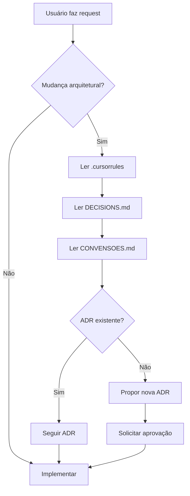

# Como o Antigravity Usa os Documentos do Projeto

## Resumo Executivo

✅ **Configuração concluída!** O Antigravity agora está configurado para **sempre** consultar os documentos do projeto antes de propor mudanças.

## Estrutura de Documentação

```
sagnus/
├── .cursorrules              # Regras para Cursor IDE
├── DECISIONS.md              # ADRs (por que fazemos assim)
├── CONVENSOES.md             # Estrutura e organização (como fazemos)
└── .agent/
    ├── README.md             # Documentação desta pasta
    └── rules.md              # ⭐ Regras do Antigravity
```

## Como Funciona

### 1. Cursor IDE (Assistente Integrado)
```
Cursor IDE → Lê .cursorrules automaticamente
           → Aplica regras ao assistente de IA
```

### 2. Antigravity (Google Gemini)
```
Antigravity → Lê .agent/rules.md
            → Consulta .cursorrules, DECISIONS.md, CONVENSOES.md
            → Aplica regras antes de propor soluções
```

## Fluxo de Trabalho do Antigravity



## Exemplos Práticos

### Exemplo 1: Criar Novo Repositório

**Request:** "Crie um repositório para Produto"

**Antigravity:**
1. ✅ Consulta `CONVENSOES.md` § 2 (Regras de Persistência)
2. ✅ Consulta `CONVENSOES.md` § 3 (Nomenclatura)
3. ✅ Cria:
   - `domain/repository/ProdutoRepository.java` (port)
   - `infrastructure/persistence/repository/ProdutoJpaRepository.java` (Spring Data)
   - `infrastructure/persistence/adapter/ProdutoRepositoryImpl.java` (adapter)
   - `infrastructure/persistence/entity/ProdutoEntity.java` (JPA)
   - `infrastructure/persistence/mapper/ProdutoEntityMapper.java` (mapper)

### Exemplo 2: Adicionar Lógica no Gateway

**Request:** "Adicione cálculo de desconto no Gateway"

**Antigravity:**
1. ✅ Consulta `DECISIONS.md` ADR-0011
2. ❌ Identifica violação: "Gateway não pode ter lógica de domínio"
3. ✅ Propõe alternativa: "Mover cálculo para BC Corp"

### Exemplo 3: Implementar Regra Fiscal

**Request:** "Adicione cálculo de IVA Dual"

**Antigravity:**
1. ✅ Consulta `DECISIONS.md` ADR-0012
2. ✅ Consulta `.cursorrules` (seção FISCAL / IVA DUAL)
3. ✅ Implementa em `domain/service/CalculadoraIvaService`
4. ✅ Usa `BigDecimal` com `RoundingMode.HALF_UP`

## Garantias

### O que o Antigravity SEMPRE fará:

✅ Consultar documentos antes de propor mudanças arquiteturais  
✅ Citar ADRs e seções ao justificar decisões  
✅ Seguir estrutura de pacotes do `CONVENSOES.md`  
✅ Respeitar convenções de nomenclatura  
✅ Manter domínio puro (sem Spring/JPA)  
✅ Usar contratos entre BCs  

### O que o Antigravity NUNCA fará:

❌ Propor soluções que conflitem com ADRs  
❌ Criar estruturas de pacotes diferentes do padrão  
❌ Importar diretamente de outros BCs  
❌ Colocar anotações Spring/JPA no domínio  
❌ Criar persistência no API Gateway  
❌ Duplicar regras fiscais  

## Testando a Configuração

Você pode testar se está funcionando fazendo requests como:

1. **"Crie um novo BC chamado bc-vendas"**
   - Antigravity deve consultar `CONVENSOES.md` § 1 e criar estrutura padrão

2. **"Adicione uma tabela no Gateway"**
   - Antigravity deve recusar e citar `DECISIONS.md` ADR-0011

3. **"Onde devo colocar um port de integração com email?"**
   - Antigravity deve consultar `DECISIONS.md` ADR-0010 e responder `application/port/out/`

## Manutenção

### Quando atualizar `.agent/rules.md`

- ✅ Adicionar novos documentos de referência
- ✅ Mudar workflow de desenvolvimento
- ❌ Mudar regras técnicas (atualizar `.cursorrules` ao invés)

### Sincronização de Documentos

Sempre que atualizar:
- `.cursorrules` → Regras técnicas mudaram
- `DECISIONS.md` → Nova ADR adicionada
- `CONVENSOES.md` → Estrutura/organização mudou

Verifique se `.agent/rules.md` ainda aponta corretamente para eles.

## Próximos Passos

1. ✅ **Configuração concluída** — Antigravity já está usando as regras
2. 🔄 **Teste** — Faça alguns requests para validar
3. 📝 **Feedback** — Ajuste `.agent/rules.md` se necessário

---

**Criado em:** 2026-01-19  
**Status:** ✅ Ativo
